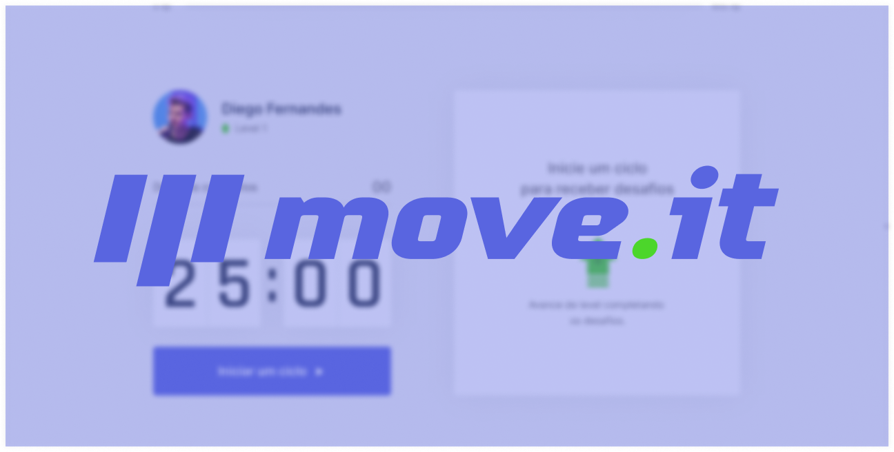

  

## 🚀 Tecnologias

Esse projeto foi desenvolvido com as seguintes tecnologias:

- [Typescript](https://www.typescriptlang.org/)
- [React](https://reactjs.org)
- [Next.js](https://nextjs.org/)

## 💻 Projeto

Move It é um projeto para ajudar as pessoas a fazerem mais exercícios.

## 🔖 Layout

Você pode visualizar o layout do projeto no formato através [desse link](https://www.figma.com/file/ge20pu3ofMOKoliUyKx1Nl/Move.it-1.0/duplicate?node-id=160%3A2761). Lembrando que você irá precisar ter uma conta no [Figma](http://figma.com/).

## 🤔 Como contribuir

- Faça um fork desse repositório;
- Cria uma branch com a sua feature:  `git checkout -b minha-feature`;
- Faça commit das suas alterações:  `git commit -m 'feat: Minha nova feature'`;
- Faça push para a sua branch:  `git push origin minha-feature`.

Depois que o merge da sua pull request for feito, você pode deletar a sua branch.

---

Feito com ♥ by Rocketseat 👉️ [Participe da nossa comunidade!](https://discordapp.com/invite/gCRAFhc)

---

